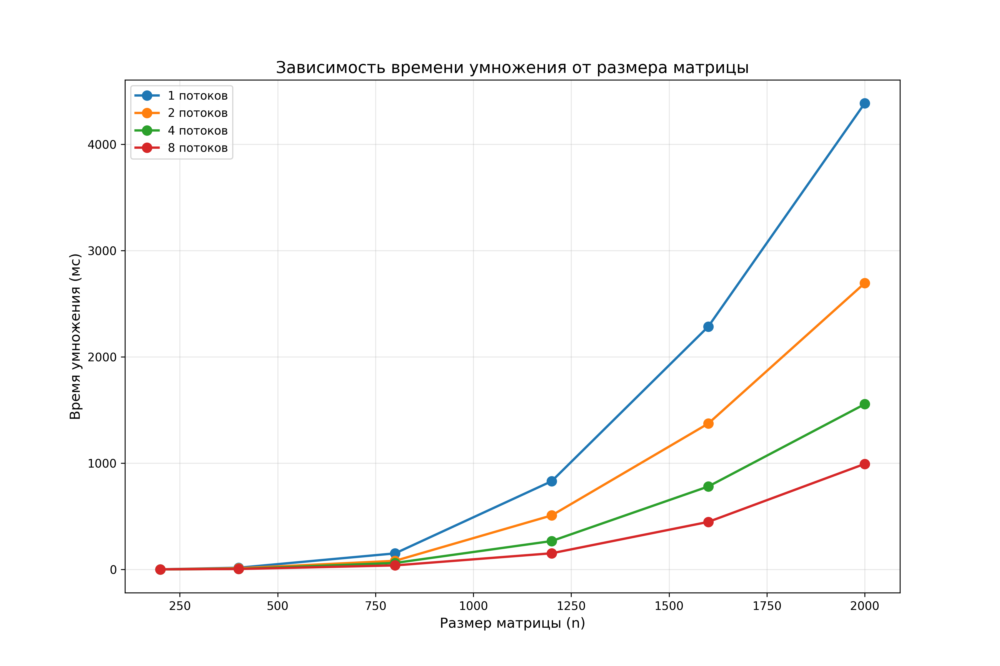
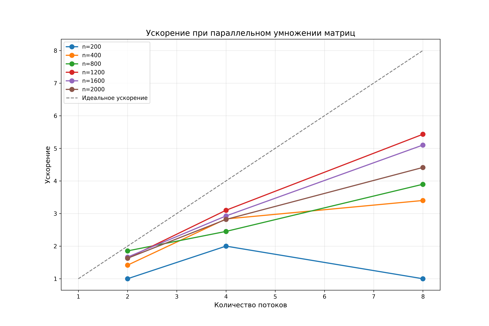
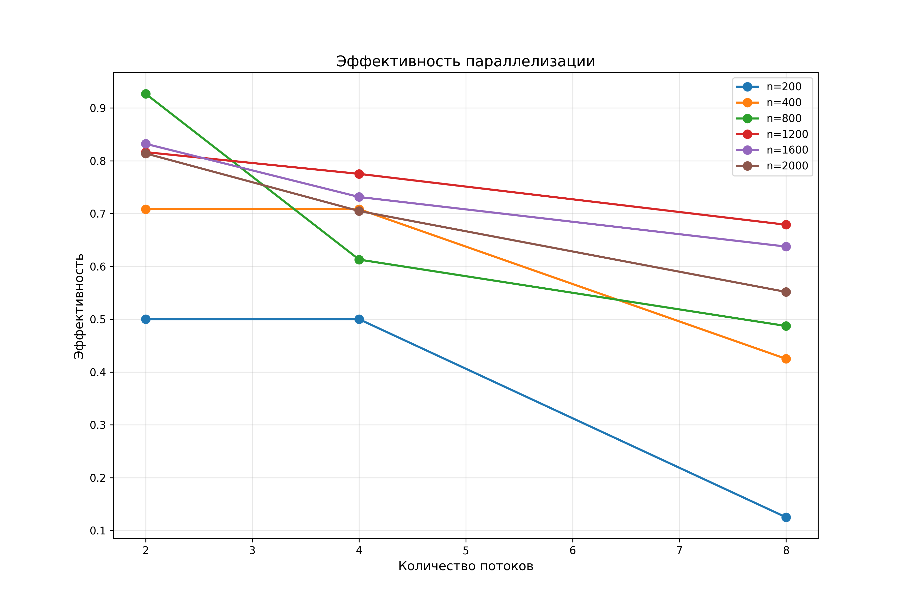

# Лабораторная работа №1: Параллельное умножение матриц с OpenMP

## 📝 Задание

Модифицировать программу из лабораторной работы №1 для параллельной работы по технологии OpenMP. Провести серию экспериментов с разным количеством потоков (1, 2, 4, 8 и т.д.), разными размерами матриц (200, 400, 800, 1200, 1600, 2000), с разным количеством вычислительных ядер.

## ⚙️ Ход работы

### 1. Модификация программы

Была модифицирована часть умножения матриц с использованием технологии OpenMP. Основные изменения:

- Реализована возможность задания количества потоков через параметры командной строки
- Добавлены функции для измерения времени выполнения на каждом этапе
- Внедрена система автоматического сбора статистики в файл `stats.txt`

### 2. Проведение экспериментов

Была добавлена часть для проведения исследования с разным количеством потоков. Эксперименты проводились для следующих конфигураций:

**Размеры матриц:** 200, 400, 800, 1200, 1600, 2000
**Количество потоков:** 1, 2, 4, 8

Для автоматизации экспериментов был разработан скрипт `experiments.bat`, который последовательно запускает программу для всех комбинаций параметров.

### 3. Сбор и обработка результатов
На основе собранных данных были построены графики:
- Зависимость времени умножения от размера матрицы
- Ускорение при параллельном умножении
- Эффективность параллелизации

**Более точные данные представлены в файлах:** `stats.txt`, `mult_time_vs_size.png`, `speedup.png`, `efficiency.png`

## 📊 Результаты

| Размер | Потоков | Чтение(мс) | Умножение(мс) | Запись(мс) | Всего(мс) |
|--------|---------|------------|---------------|------------|-----------|
| 200 | 1 | 100 | 2 | 32 | 134 |
| 200 | 2 | 31 | 2 | 40 | 73 |
| 200 | 4 | 30 | 1 | 50 | 81 |
| 200 | 8 | 30 | 2 | 52 | 84 |
| 400 | 1 | 255 | 17 | 136 | 408 |
| 400 | 2 | 126 | 12 | 152 | 290 |
| 400 | 4 | 126 | 6 | 166 | 298 |
| 400 | 8 | 122 | 5 | 178 | 305 |
| 800 | 1 | 556 | 152 | 569 | 1277 |
| 800 | 2 | 529 | 82 | 607 | 1218 |
| 800 | 4 | 516 | 62 | 589 | 1167 |
| 800 | 8 | 519 | 39 | 651 | 1209 |
| 1200 | 1 | 1309 | 831 | 1402 | 3542 |
| 1200 | 2 | 1215 | 509 | 1441 | 3165 |
| 1200 | 4 | 1243 | 268 | 1476 | 2987 |
| 1200 | 8 | 1264 | 153 | 1521 | 2938 |
| 1600 | 1 | 2399 | 2285 | 2641 | 7325 |
| 1600 | 2 | 2360 | 1373 | 2734 | 6467 |
| 1600 | 4 | 2391 | 781 | 2791 | 5963 |
| 1600 | 8 | 2382 | 448 | 2837 | 5667 |
| 2000 | 1 | 4048 | 4387 | 4297 | 12732 |
| 2000 | 2 | 3978 | 2695 | 4630 | 11303 |
| 2000 | 4 | 3893 | 1556 | 4587 | 10036 |
| 2000 | 8 | 3967 | 994 | 4636 | 9597 |

### Визуализация

| Время умножения | Ускорение | Эффективность |
|-----------------|-----------|---------------|
|  |  |  |

## 📈 Анализ

### Ускорение (Speedup)

| Размер | 2 потока | 4 потока | 8 потоков |
|--------|----------|----------|-----------|
| 200 | 1.00 | 2.00 | 1.00 |
| 400 | 1.42 | 2.83 | 3.40 |
| 800 | 1.85 | 2.45 | 3.90 |
| 1200 | 1.63 | 3.10 | **5.43** |
| 1600 | 1.66 | 2.93 | 5.10 |
| 2000 | 1.63 | 2.82 | 4.41 |

### Эффективность (Efficiency)

| Размер | 2 потока | 4 потока | 8 потоков |
|--------|----------|----------|-----------|
| 200 | 50% | 50% | 13% |
| 400 | 71% | 71% | 43% |
| 800 | **93%** | 61% | 49% |
| 1200 | 82% | 78% | 68% |
| 1600 | 83% | 73% | 64% |
| 2000 | 82% | 71% | 55% |

## 📌 Вывод

В ходе работы была модифицирована программа из лабораторной работы №1 для параллельной работы по технологии OpenMP. Проведена серия экспериментов с разным количеством потоков (1, 2, 4, 8), разными размерами матриц (200, 400, 800, 1200, 1600, 2000).

**Основные результаты:**
- Достигнуто максимальное ускорение **5.43x** для матрицы 1200×1200 при использовании 8 потоков
- Наивысшая эффективность **93%** зафиксирована для матрицы 800×800 на 2 потоках
- Для малых матриц (≤400) достаточно 2-4 потоков
- Для средних и больших матриц (≥800) использование 8 потоков наиболее эффективно
