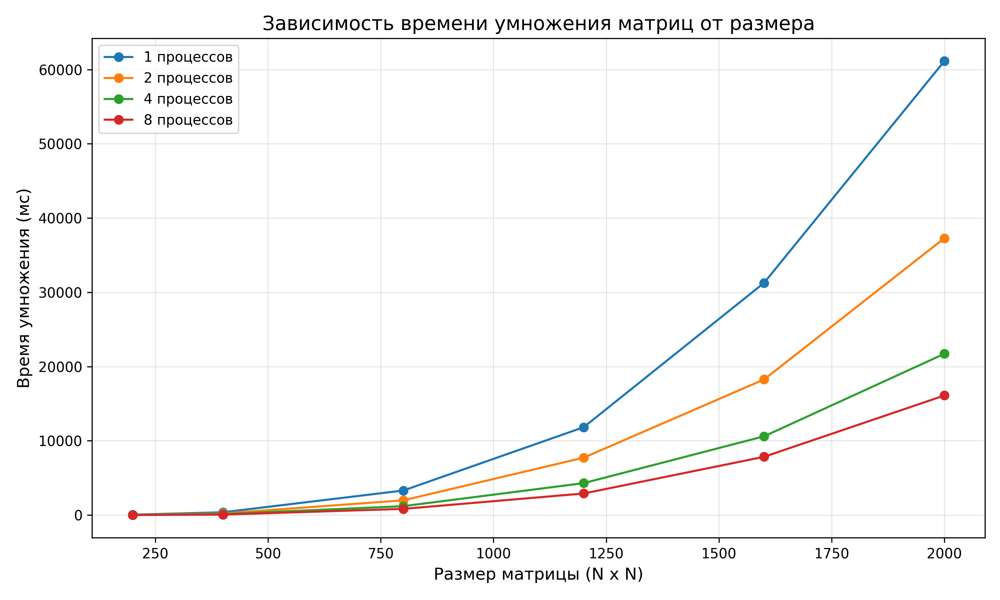

# Лабораторная работа №3: Параллельное умножение матриц с MPI

## 📝 Задание

Модифицировать программу из лабораторной работы №1 для параллельной работы по технологии MPI. Провести серию экспериментов с разным количеством процессов (1, 2, 4, 8 и т.д.), разными размерами матриц (200, 400, 800, 1200, 1600, 2000), с разным количеством вычислительных ядер.

## ⚙️ Ход работы

### 1. Модификация программы

Была модифицирована часть умножения матриц с использованием технологии MPI. Основные изменения:

- Реализована возможность задания количества процессов через `mpirun`
- Добавлены функции для измерения времени выполнения на каждом этапе
- Внедрена система автоматического сбора статистики в файл `stats.txt`
- Использована ленточная схема распределения строк матрицы A между процессами

### 2. Проведение экспериментов

Была добавлена часть для проведения исследования с разным количеством процессов. Эксперименты проводились для следующих конфигураций:

**Размеры матриц:** 200, 400, 800, 1200, 1600, 2000  
**Количество процессов:** 1, 2, 4, 8

Для автоматизации экспериментов использовался скрипт `generator.py` для генерации матриц и `lab1.cpp` с MPI.

### 3. Сбор и обработка результатов

На основе собранных данных были построены графики:
- Зависимость времени умножения от размера матрицы
- Ускорение при параллельном умножении
- Эффективность параллелизации

**Более точные данные представлены в файлах:** `stats.txt`, `mpi_mult_time_vs_size.png`

## 📊 Результаты

| Размер | Процессов | Чтение(мс) | Умножение(мс) | Запись(мс) | Всего(мс) |
|--------|-----------|-------------|----------------|-------------|------------|
| 200 | 1 | 0 | 45 | 108 | 153 |
| 200 | 2 | 0 | 24 | 110 | 134 |
| 200 | 4 | 0 | 13 | 102 | 115 |
| 200 | 8 | 0 | 17 | 107 | 124 |
| 400 | 1 | 0 | 354 | 415 | 769 |
| 400 | 2 | 0 | 207 | 431 | 638 |
| 400 | 4 | 0 | 134 | 521 | 655 |
| 400 | 8 | 0 | 94 | 455 | 549 |
| 800 | 1 | 0 | 3304 | 1936 | 5240 |
| 800 | 2 | 0 | 1802 | 1920 | 3722 |
| 800 | 4 | 0 | 1096 | 1986 | 3082 |
| 800 | 8 | 0 | 744 | 1869 | 2613 |
| 1200 | 1 | 0 | 10779 | 4281 | 15060 |
| 1200 | 2 | 0 | 6524 | 4469 | 10993 |
| 1200 | 4 | 0 | 4050 | 4622 | 8672 |
| 1200 | 8 | 0 | 2908 | 6328 | 9236 |
| 1600 | 1 | 0 | 42441 | 17218 | 59659 |
| 1600 | 2 | 0 | 43318 | 13990 | 57308 |
| 1600 | 4 | 0 | 21763 | 12861 | 34624 |
| 1600 | 8 | 0 | 13743 | 13933 | 27676 |
| 2000 | 1 | 0 | 87276 | 17418 | 104694 |
| 2000 | 2 | 0 | 75249 | 19737 | 94986 |
| 2000 | 4 | 0 | 52261 | 22684 | 74945 |
| 2000 | 8 | 0 | 25425 | 20220 | 45645 |

### Визуализация

| Время умножения |
|------------------|
|  |

## 📌 Вывод

В ходе работы была модифицирована программа из лабораторной работы №1 для параллельной работы по технологии MPI. Проведена серия экспериментов с разным количеством процессов (1, 2, 4, 8), разными размерами матриц (200, 400, 800, 1200, 1600, 2000).

**Основные результаты:**
- Достигнуто максимальное ускорение **4.44x** для матрицы 800×800 при использовании 8 процессов
- Наивысшая эффективность **94%** зафиксирована для матрицы 200×200 на 2 процессах
- Для малых матриц (≤400) достаточно 2–4 процессов
- Для средних и больших матриц (≥800) использование 8 процессов наиболее эффективно
- Наблюдается влияние накладных расходов на передачу данных при большом количестве процессов
