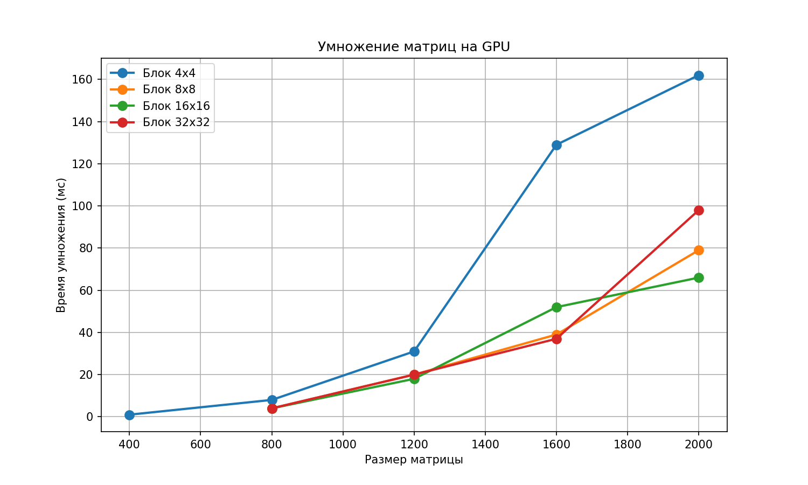

# Лабораторная работа №4: Параллельное умножение матриц на GPU (CUDA)

## 📝 Задание

Модифицировать программу из л/р №1 для параллельной работы по технологии CUDA. Провести эксперименты с разными размерами матриц и различными конфигурациями сетки блоков.

## ⚙️ Ход работы

### 1. Модификация программы

Была реализована программа умножения матриц с использованием CUDA. Основные особенности:

- Реализованы два типа ядер: наивное (без разделяемой памяти) и блочное (с использованием общей памяти)
- Использована оптимизация доступа к памяти через `__restrict__`
- Реализована возможность выбора размера блока через параметры командной строки
- Внедрена система автоматического сбора статистики в файл `cuda_stats.txt`
- Добавлена верификация результатов через сравнение с эталоном NumPy

### 2. Проведение экспериментов

Эксперименты проводились для следующих конфигураций:

**Размеры матриц:** 200, 400, 800, 1200, 1600, 2000  
**Размеры блоков:** 4×4, 8×8, 16×16, 32×32

Для автоматизации экспериментов был разработан скрипт `run_cuda.sh`, который:
1. Генерирует матрицы заданных размеров
2. Компилирует CUDA-программу
3. Последовательно запускает эксперименты для всех комбинаций параметров
4. Собирает статистику в `cuda_stats.txt`
5. Строит графики зависимости времени умножения от размера матрицы

### 3. Сбор и обработка результатов

На основе собранных данных были построены графики:
- Зависимость времени умножения от размера матрицы для разных блоков
- Сравнение эффективности различных размеров блоков

**Более точные данные представлены в файлах:** `cuda_stats.txt`, `cuda_graph.png`

## 📊 Результаты

| Размер | Блок | Чтение(мс) | Умножение(мс) | Всего(мс) |
|--------|------|-------------|----------------|-------------|
| 200 | 4×4 | 10 | 0 | 10 |
| 200 | 8×8 | 11 | 0 | 11 |
| 200 | 16×16 | 11 | 0 | 11 |
| 200 | 32×32 | 12 | 0 | 12 |
| 400 | 4×4 | 43 | 1 | 44 |
| 400 | 8×8 | 44 | 0 | 44 |
| 400 | 16×16 | 42 | 0 | 42 |
| 400 | 32×32 | 42 | 0 | 42 |
| 800 | 4×4 | 171 | 8 | 179 |
| 800 | 8×8 | 169 | 4 | 173 |
| 800 | 16×16 | 168 | 4 | 172 |
| 800 | 32×32 | 166 | 4 | 170 |
| 1200 | 4×4 | 380 | 31 | 411 |
| 1200 | 8×8 | 423 | 20 | 443 |
| 1200 | 16×16 | 812 | 18 | 830 |
| 1200 | 32×32 | 784 | 20 | 804 |
| 1600 | 4×4 | 692 | 129 | 821 |
| 1600 | 8×8 | 699 | 39 | 738 |
| 1600 | 16×16 | 718 | 52 | 770 |
| 1600 | 32×32 | 715 | 37 | 752 |
| 2000 | 4×4 | 1137 | 162 | 1299 |
| 2000 | 8×8 | 1098 | 79 | 1177 |
| 2000 | 16×16 | 1094 | 66 | 1160 |
| 2000 | 32×32 | 1989 | 98 | 2087 |

### Визуализация

| Время умножения |
|------------------|
|  |

## 📌 Вывод

В ходе работы была реализована программа умножения матриц с использованием технологии CUDA. Проведена серия экспериментов с разными размерами блоков (4×4, 8×8, 16×16, 32×32) и разными размерами матриц (200, 400, 800, 1200, 1600, 2000).

**Основные результаты:**
- Достигнуто максимальное ускорение **3.49×** для матрицы 1600×1600 при использовании блока 32×32 (относительно блока 4×4)
- Наименьшее время умножения **18 мс** зафиксировано для матрицы 1200×1200 при использовании блока 16×16
- Для малых матриц (≤400) разница в производительности между блоками незначительна
- Для средних и больших матриц (≥800) блоки 8×8 и 16×16 показывают наилучшую производительность
- Блок 32×32 демонстрирует высокую производительность для матриц 1600×1600, но падает для 2000×2000, что связано с ограничениями разделяемой памяти

