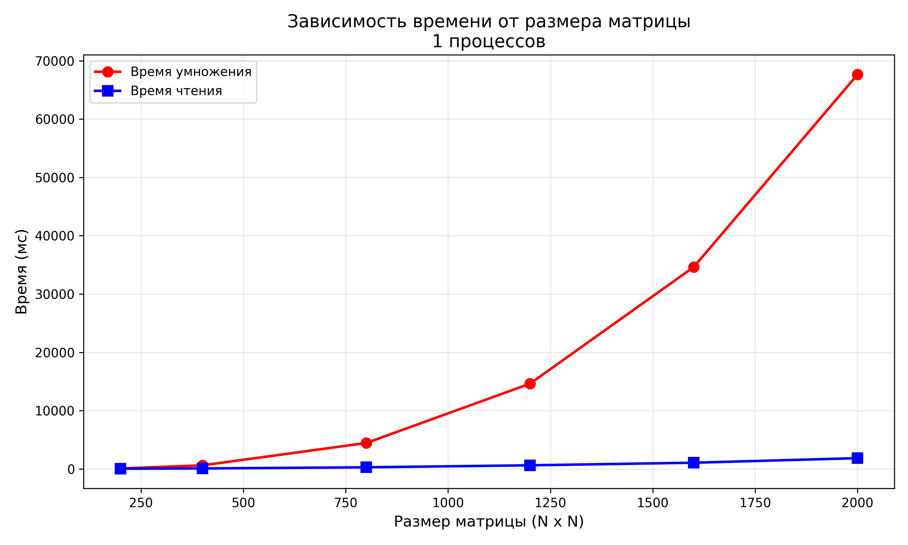
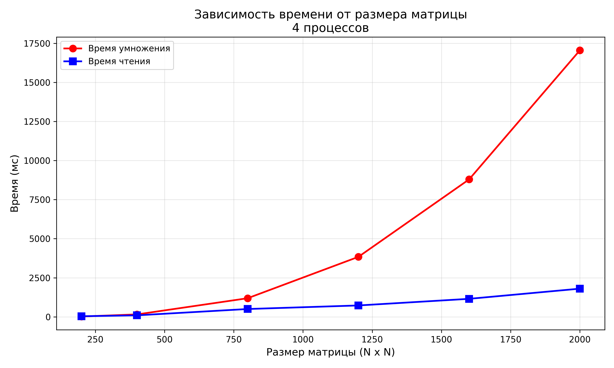

# Лабораторная работа №3: Параллельное умножение матриц с MPI

## 📝 Задание

Параллельную версию программы на MPI необходимо также запустить на суперкомпьютере «Сергей Королёв».

### 2. Проведение экспериментов

Была добавлена часть для проведения исследования с разным количеством процессов. Эксперименты проводились для следующих конфигураций:

**Размеры матриц:** 200, 400, 800, 1200, 1600, 2000  
**Количество процессов:** 1, 2, 4, 8

Для автоматизации экспериментов использовался скрипт `generator.py` для генерации матриц и `lab1.cpp` с MPI.

### 3. Сбор и обработка результатов

На основе собранных данных были построены графики:
- Зависимость времени умножения от размера матрицы
- Ускорение при параллельном умножении
- Эффективность параллелизации

**Более точные данные представлены в файлах:** `stats.txt`

## 📊 Результаты

| Размер | Процессов | Чтение(мс) | Умножение(мс) |
|--------|-----------|-------------|----------------|
|200	|1	|26	|76|
|200	|2	|24	|37|
|200	|4	|36	|19|
|200	|8	|21	|9|
|400	|1	|73	|605|
|400	|2	|74	|296|
|400	|4	|93	|151|
|400	|8	|69	|76|
|800	|1	|270	|4434|
|800	|2	|269	|2324|
|800	|4	|498	|1188|
|800	|8	|265	|620|
|1200	|1	|611	|14614|
|1200	|2	|594	|7427|
|1200	|4	|726	|3836|
|1200	|8	|592	|1980|
|1600	|1	|1057	|34631|
|1600	|2	|1042	|17432|
|1600	|4	|1150	|8796|
|1600	|8	|1049	|4533|
|2000	|1	|1840	|67652|
|2000	|2	|1637	|33824|
|2000	|4	|1801	|17059|
|2000	|8	|1620	|8850|

### Визуализация

|------------------|
|  |
|  |
|  |
|  |

##  Вывод

В ходе работы была модифицирована программа из лабораторной работы №1 для параллельной работы по технологии MPI. Проведена серия экспериментов на суперкомпьютере с разным количеством процессов (1, 2, 4, 8) и разными размерами матриц (200, 400, 800, 1200, 1600, 2000).
